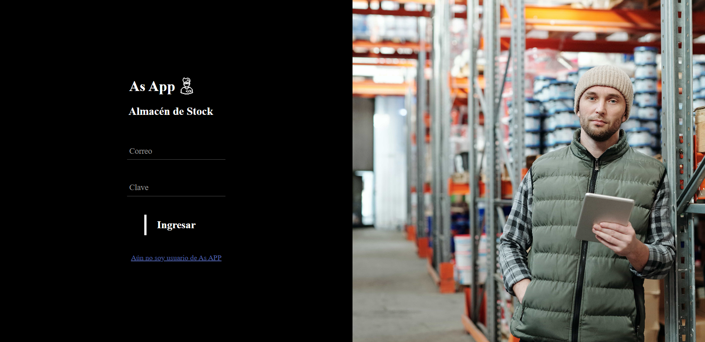
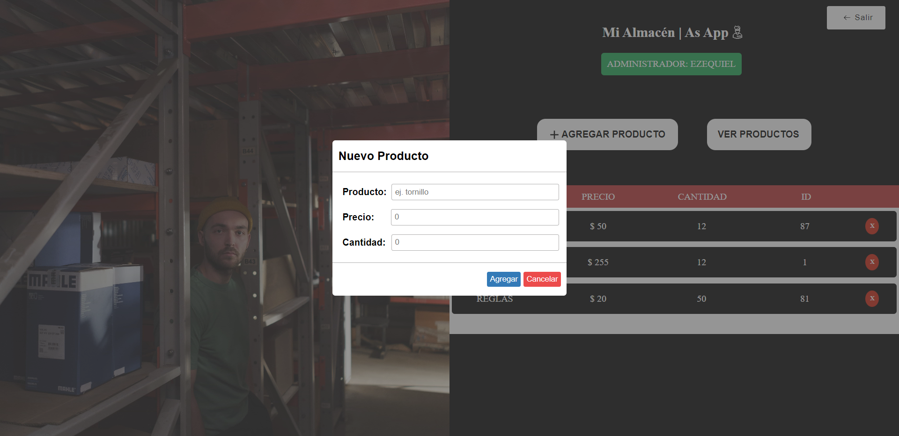

# almacenDeStock

### `Proyecto Final CoderHouse JavaScript`

El proyecto fue realizado mientras desarrolle el curso de JavaScript de CoderHouse.
Se trata de una almacén de productos, donde varios usarios pueden registrarse y acceder con un login como administradores y poder CREAR - LEER - ACTUALIZAR Y ELIMINAR productos. 
Simule un CRUD con una base de datos en el LOCAL STORAGE consumida como una APPI a travez del método FETCH(), jugando con objetos, arreglos y clases.

Un poco de lo que utilicé para realizar el proyecto:

   FUNCIONES  ✔
   METODOS  ✔
   CLASES  ✔
   OBJETOS  ✔
   ARREGLOS  ✔
   BUCLES ✔
   CONDICIONALES ✔
   LOCAL STORAGE ✔
   DOM  ✔
   EVENTOS ✔
   LIBRERIAS ✔
   PROMESAS Y FETCH ✔

Estas son algunas imagenes del proyecto (no se realizo versión responsive mobile).

